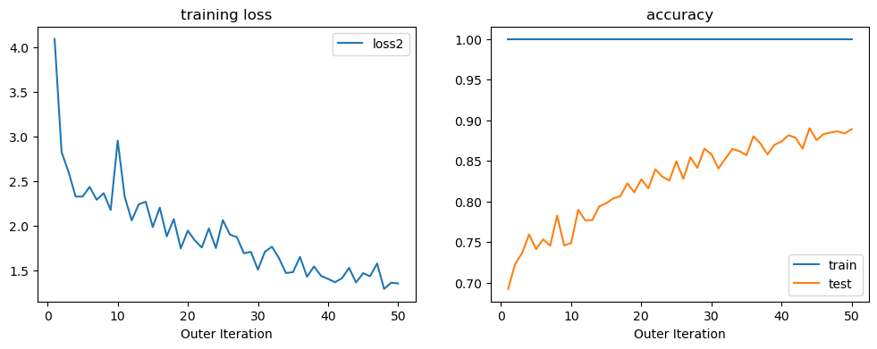
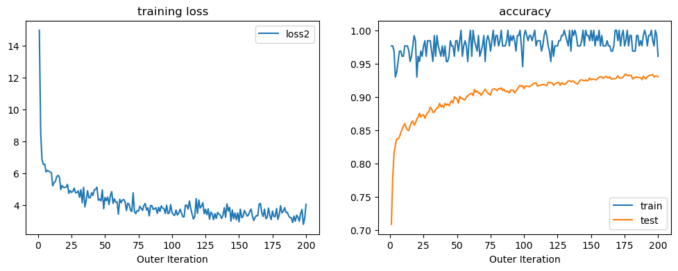
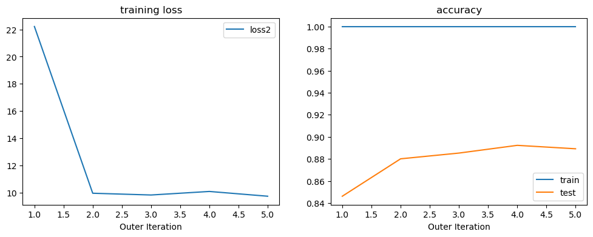
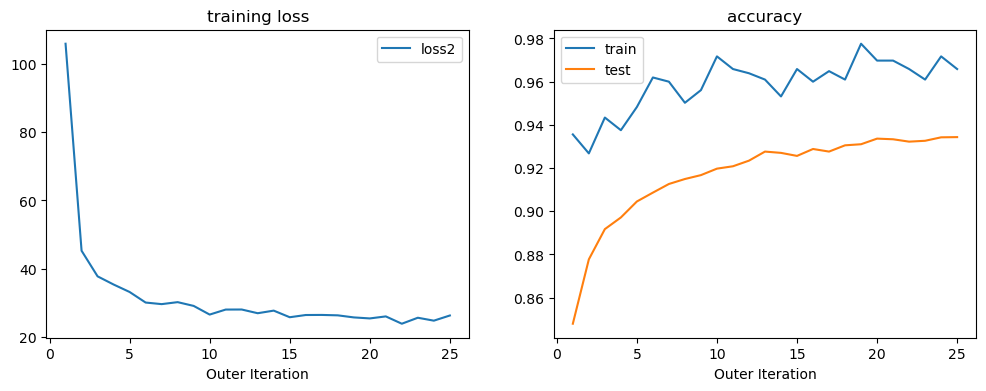

# EPFL - OptML - CS-439 - Project

### TODO
- [ ] Compare BCD batch to stardard gradient descent mini-batch (time, convergence, accuracy)
- [ ] BCD with mini-batch


## Results

The datasets is mnist data, flattened in to 
- x_train of shape (60_000, 28x28), y_train of shape (60_000,)
- x_test of shape (10_000, 28x28), y_test of shape (10_000,)

All BCD use deep network with 3 hidden layers each contains 1500 neurons, the output layer is of size 10. 

### BCD vs Stadard SGD

| Models | CPU | GPU Allocated | GPU Cached | Training time | Final test acc | iters before achieving 0.94 acc
| --- | --- | --- | --- | --- | --- | --- |
| BCD full batch | 2386.0 - 562.4 | 2090.3 | 5128.0 | ~76  s   | 0.946 | 15 |
| BCD b4096      | 2553.2 - 562.5 | 166.0  | 794.0  | ~117 s   | 0.948 | 13x12 |
| SGD momentum 0.9 | 2255.6 - 537.9 | 0.7  | 2.0    | ~58  s   | 0.945 | 41 |
| RMSProp        | 2258.7 - 539.5   | 0.7  | 2.0    | ~61  s   | 0.965 | 11 |
| Adam           | 2257.2 - 539.5   | 0.9  | 2.0     | ~69 s   | 0.957 | 23 |


**Notes**
- Memory usage in MB
- Training time does not include time consumed for validation during training.
- full batch runs 50 iterations each passes through all 60_000 training data, achieves test acc of 0.94 after 15 epochs.
- BCD b4096 runs 50x12 iterations, each passes through 4096 training data, ahieves test acc of 0.94 after 13x12 iterations. 
- SGD momentum uses momentum coefficient 0.9, lr=1e-1
- RMSprop uses lr=1e-3
- Adam uses lr=3e-4

### Effect of `niter_outer` and `niter_inner` on training

The adapted algorithm:
```python
def train(niter_outer, niter_inner):
    for iter in range(niter_outer):
        x_train, y_train = sample_batch(...)
        forward_pass(x_train)
        for k in range(niter_inner):
            backward_pass(x_train, y_train, ...)
```

| batch size | `niter_outer` | `niter_inner` | acc train* | acc test |
| --- | --- | --- | ---   | ---   |
| 128 | 300 | 10  | 0.959 | 0.931 | * 
| 128 | 200 | 15  | 0.961 | 0.933 | *
| 128 | 100 | 30  | 1     | 0.915 |
| 128 | 50  | 60  | 1     | 0.889 | *
| 256 | 300 | 5   | 0.92  | 0.921 |
| 250 | 150 | 10  | 0.945 | 0.932 | *
| 256 | 100 | 15  | 0.965 | 0.936 | *
| 256 | 50  | 30  | 1     | 0.919 | *
| 256 | 10  | 150 | 1     | 0.808 | *
| 512 | 3   | 250 | 1     | 0.812 | *
| 512 | 30  | 25  | 0.994 | 0.923 | *
| 1024| 5   | 75  | 1     | 0.889 | *
| 1024| 15  | 25  | 0.98  | 0.932 | *
| 1024| 25  | 15  | 0.966 | 0.934 | *
| 1024| 75  | 5   | 0.917 | 0.919 | *
| 2048| 6   | 30  | 0.985 | 0.934 | *
| 2048| 9   | 20  | 0.971 | 0.936 | *
| 2048| 6   | 30  | 0.985 | 0.934 | *
| 2048| 12  | 15  | 0.950 | 0.937 | *
| 2048| 12  | 15  | 0.949 | 0.932 | *
| 4096| 6   | 15  | 0.956 | 0.937 |
| 4098| 5   | 18  | 0.957 | 0.935 |


**Notes**
- *acc train is the accuracy of the last inner loop iteration, measured on the batch of data used for the inner loop, thus this value could be very noisy due to little data in the mini-batch. 
- acc test is the accuracy of the last inner loop iteration, measured on the whole test data (10_000 samples). 
- acc train is 1 means that model perfectly classifies that mini-batch of data. 
- 

### `niter_outer` and `niter_inner` against overfitting

Setting:
- Experiments with fixed `niter_outer` x `niter_inner` x `batch_size`. 
- For a fixed `batch_size`, different values of `niter_inner` and `niter_outer` have been experimented, though the product of two is fixed.

Observation:
- Too large `niter_inner` leads to overfitting of the model, 
- however the learning will be significantly slower with too small `niter_inner`


Params and results:
```python
    batch_size = 128
    niter_outer = 50
    niter_inner = 60
```



Params and results:
```python
    batch_size = 128
    niter_outer = 200
    niter_inner = 15
```



Params and results:
```python
    batch_size = 256
    niter_outer = 50
    niter_inner = 30
```


Params and results:
```python
    batch_size = 256
    niter_outer = 100
    niter_inner = 15
```


Params and results:
```python
    batch_size = 1024
    niter_outer = 5
    niter_inner = 75
```



Params and results:
```python
    batch_size = 1024
    niter_outer = 25
    niter_inner = 15
```



Params and results:
```python
    batch_size = 1024
    niter_outer = 75
    niter_inner = 5
```


